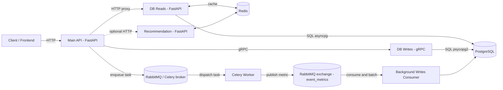

# Yaya — Event Planning Microservices (Backend)

Yaya is a microservices-style backend for an event planning and discovery app. It combines:

- **Synchronous** service-to-service calls (gRPC) for essential, transactional **writes**
- **Asynchronous** processing (Celery + RabbitMQ) for non-essential **background writes** like event metrics
- **FastAPI** HTTP services for the public API gateway and read-heavy endpoints
- **PostgreSQL** as the system of record, with **Redis** for caching and fast lookups

This repository focuses on clear separation of concerns:

- The **Main API** acts as an API Gateway/BFF: authentication, request validation, and fan-out to internal services.
- **Reads** and **writes** are split into dedicated services (a CQRS-style approach).
- Metrics and other non-critical updates are pushed to an async pipeline to keep user-facing requests fast.

## Tech stack

**Languages & frameworks**
- Python, FastAPI, Uvicorn
- gRPC (grpcio, protobuf)

**Async & messaging**
- RabbitMQ (AMQP)
- Celery (task queue)

**Data**
- PostgreSQL (primary datastore)
- Redis (caching / recommendation cache)

**Key libraries**
- `asyncpg` (async Postgres reads)
- `psycopg2` (Postgres writes)
- `httpx` (service-to-service HTTP)
- `python-jose` / JWT (auth)

## Architecture



## Key request flows

**1) Essential writes (transactional)**
- `Client -> Main API (HTTP) -> DB Writes (gRPC) -> Postgres`

**2) Read-heavy endpoints**
- `Client -> Main API (HTTP) -> DB Reads (HTTP) -> Postgres`
- Optional caching happens in `db_reads` via Redis.

**3) Background metrics (event impressions/clicks/saves/shares)**
- `Client -> Main API -> enqueue Celery task -> RabbitMQ -> Celery Worker -> RabbitMQ exchange (event_metrics) -> Background Writes -> Postgres`

## Services

| Service | Code | Default port | Protocol(s) | Purpose |
|---|---|---:|---|---|
| Main API (Gateway) | `microservices/main.py` | 8000 | HTTP | Auth + public API; proxies reads, calls gRPC for writes, enqueues background jobs |
| DB Reads | `microservices/db_reads/db_reads.py` | 8001 | HTTP | Read-optimized endpoints (events, profiles, etc.), optional Redis caching |
| DB Writes | `microservices/db_writes/db_writes.py` | (env) | gRPC | Transactional writes (create entities, follow/unfollow, ticket purchase, etc.) |
| Celery Worker | `microservices/background_writes/celery_worker.py` | n/a | AMQP | Executes queued tasks and publishes metrics to RabbitMQ |
| Background Writes Consumer | `microservices/background_writes/background_writes.py` | n/a | AMQP | Consumes metrics, buffers them, and periodically flushes aggregates to Postgres |
| Recommendation | `microservices/recommendation/recommendation.py` | 8002 | HTTP | Placeholder recommendation endpoint with Redis-backed caching |

## Project structure

| Path | What it contains |
|---|---|
| `microservices/` | All runtime services (FastAPI, gRPC server, Celery worker, consumers) |
| `db_triggers/` | SQL tables/triggers used by the Postgres schema |
| `dumps/` | Local SQL dumps (development artifacts) |
| `requirements.txt` | Python dependencies for the services |
| `start_services.sh` | macOS helper script to start multiple services |

## Local setup

### Prerequisites

- Python 3.11+ (a local virtualenv is recommended)
- PostgreSQL
- RabbitMQ (for Celery + metrics exchange/queues)
- Redis (the code is configured for TLS/SSL connections, e.g. Upstash)

### 1) Install dependencies

```bash
python -m venv .venv
source .venv/bin/activate
pip install -r requirements.txt
```

### 2) Configure environment variables

Start from `.env.example`:

```bash
cp .env.example .env
```

Then edit `.env` (or export these vars in your shell):

- Postgres: `POSTGRE_DB`, `POSTGRE_USER`, `POSTGRE_PW`, `POSTGRE_HOST`, `POSTGRE_WRITE_PORT`
- gRPC: `GRPC_INSC_PORT` (server bind, e.g. `0.0.0.0:50051`), `GRPC_INSC_CHANNEL` (client target, e.g. `localhost:50051`)
- Internal service URLs: `DB_READER_SERVICE_URL` (e.g. `http://localhost:8001`), `RECOMMENDATION_SERVICE_URL` (e.g. `http://localhost:8002`)
- JWT: `SECRET_KEYS_CURRENT`, `SECRET_KEYS_PREVIOUS`, `JWT_ALGORITHM`, `ACCESS_TOKEN_EXPIRE_MINUTES`, `REFRESH_TOKEN_EXPIRE_DAYS`
- Redis: `REDIS_HOST`, `REDIS_PORT`, `REDIS_PASSWORD`
- Celery/RabbitMQ: `CELERY_BROKER_URL` (defaults to `pyamqp://guest@localhost//`)

Tip: keep `.env` out of git (this repo’s `.gitignore` already ignores it).

### 3) Initialize the database

Schema-related assets live in:

- `db_triggers/` (SQL files used to create tables/triggers used by the services)
- `postgre_schema.py` (historical schema helper; may be incomplete vs `db_triggers/`)

Apply the SQL files to a fresh Postgres database in a deterministic order (or integrate them into a migrations tool of your choice).

### 4) Run the services

The services expect `PYTHONPATH` to include `microservices/` so imports resolve consistently.

**Option A: macOS convenience script**

`start_services.sh` opens new Terminal windows and starts services with the project venv.

```bash
./start_services.sh --db-reads --db-writes --background --recommendation
```

**Option B: run manually (cross-platform)**

```bash
cd microservices
export PYTHONPATH="$(pwd)"

# Main API (Gateway)
uvicorn main:app --reload --port 8000

# DB Reads
cd db_reads && uvicorn db_reads:app --reload --port 8001

# Recommendation
cd ../recommendation && uvicorn recommendation:app --reload --port 8002

# DB Writes (gRPC)
cd .. && python -m db_writes.db_writes

# Background writes pipeline
celery -A background_writes.celery_worker worker --loglevel=INFO
python -m background_writes.background_writes
```

### 5) (Optional) Regenerate gRPC stubs

From the `microservices/` directory:

```bash
python -m grpc_tools.protoc \
  -I=db_writes/proto \
  --python_out=db_writes \
  --grpc_python_out=db_writes \
  db_writes/proto/write_service.proto
```

## Quick checks

**HTTP**

```bash
curl -sS http://localhost:8000/events | jq .
```

**gRPC (example)**

```bash
# List services (reflection is enabled in the gRPC server)
grpcurl -plaintext localhost:50051 list

# Example call (adjust host/port to your GRPC_INSC_PORT / GRPC_INSC_CHANNEL)
grpcurl -plaintext \
  -d '{"data":{"username":"demo_user","first_name":"Demo","last_name":"User","email":"demo@example.com","country":"nl","language":"en","birthdate":"2000-01-01","pw":"pw"}}' \
  localhost:50051 WriteService/CreateUser
```

## Notes & conventions

- **Reads vs writes**: user-facing read endpoints are served by `db_reads`, while `db_writes` owns transactional changes via gRPC.
- **Background writes**: metrics are buffered and flushed periodically (and on size thresholds) to reduce write amplification.
- **Recommendation service**: currently a scaffold; the Main API has an endpoint stubbed for future integration.
